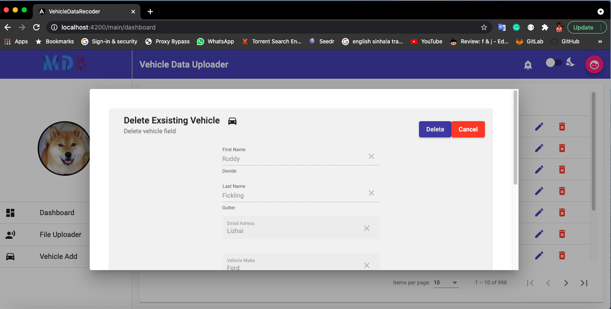

<h3 align="center">:rotating_light: :construction:&ensp;&ensp;Work In Progress&ensp;&ensp;:construction: :rotating_light:</h3>
<h1 align="center">Vehicle Web Application</h1>

> CodeLAb assignment-01 code base that belongs to my office work. This is Angular web application. &ensp;:boat: :boat:

<h2>License</h2>

> Licenses this source under the <u>MIT License</u>,You may not use this file except in compliance with the License.
<!-- Badges -->

  

<h2>Content&ensp;&ensp;:book: :book:</h2>

<ul>
    <li>CSV data File uploader</li>
    <li>All CRUD operation has implemented</li>
</ul>

<h4 align="center">Here is a screenshot of the Login page</h4>

 This window use for log into application. Before upload CSV file you need to login to application. When you enter correct user email and password application will get JWT valid token. This Token will save in web browser local storage. 

<h4 align="center">Here is a screenshot of the UI</h4>
<!-- image -->

  

> user this credentials for login.

| User Email    | Password      | 	 |
| ------------- |:-------------:| -----: |
| test@mail.com | test123	| Tested |
| dev@mail.com 	| dev123	| Tested |

**About CSV files upload page**

 This window use for upload .csv and .xlsx files. Before upload CSV file you need to select files from your local machine. You can select multiple files also. You can remove unwanted file that you have already selected. when you press submit all file will save in DataBase (PostgressQL). 

<h4 align="center">Here is a screenshot of the UI</h4>

| selected file            |  Selecting file               | uploading file
:-------------------------:|:--------------------------:|:--------------------------:
     |      | 

**About Dashboard View **

 This componet use for display every records in DB. after upload .CVS into database this view will show data. as well as user can <b>Edit</b> and <b> Delete</b> each and every records one by one.  

<h4 align="center">Here is a screenshot of the UI</h4>

| Dashboard View            |  Edit Vehicle             |  Delete Vehicle         |    Add New Vehicle           |
:-------------------------:|:--------------------------:|:--------------------------:|:-------------------------:|
     |    |  |   |
|                           |    |                            |                           |
